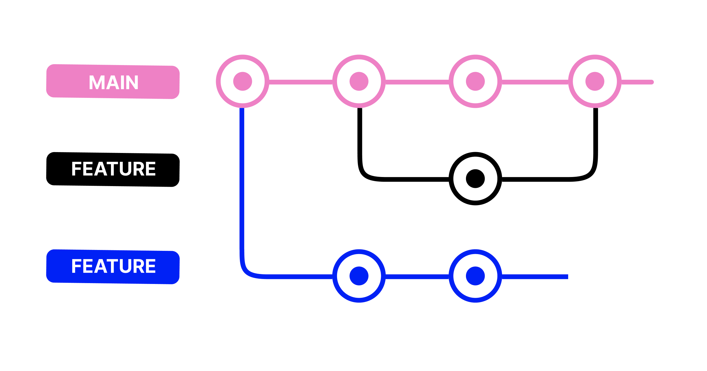

## Introduction to version control

Imagine you're writing an essay and you want to save different versions as you work:
- `essay_v1.docx`
- `essay_v2.docx`
- `essay_final.docx`
- `essay_final_FINAL.docx`
- `essay_final_FINAL_this_one.docx`

This gets messy fast! **Version control systems** solve this problem for code.

### What is version control?

Version control is a system that:
- Tracks every change you make to your files
- Lets you go back to any previous version
- Allows multiple people to work on the same project without conflicts
- Shows who changed what and when




---


## Your first Git project

### Step 1: Install Git

**Check if Git is installed:**
```bash
git --version
```

**If not installed:**
- Windows: Download from [git-scm.com](https://git-scm.com/)
- Mac: Install via Homebrew: `brew install git` or download from [git-scm.com](https://git-scm.com/)
- Linux: `sudo apt install git` (Ubuntu/Debian)

### Step 2: Configure Git

```bash
git config --global user.name "Your Name"
git config --global user.email "your.email@example.com"
```

### Step 3: Create a repository

```bash
# Navigate to your project folder
cd my-first-webpage

# Initialize Git
git init
```

You should see: `Initialized empty Git repository`

### Step 4: Make your first commit

```bash
# Check status
git status

# Stage all files
git add .

# Commit with message
git commit -m "Initial commit - my first webpage"
```

### Step 5: Create GitHub account

1. Go to [github.com](https://github.com)
2. Sign up for free account
3. Verify your email

### Step 6: Create a repository on GitHub

1. Click the **+** icon in top right
2. Select **New repository**
3. Name it `my-first-webpage`
4. Keep it public (or private if you prefer)
5. Don't initialize with README (you already have files)
6. Click **Create repository**

### Step 7: Connect local repo to GitHub

GitHub will show you commands. Run these:

```bash
git remote add origin https://github.com/YOUR-USERNAME/my-first-webpage.git
git branch -M main
git push -u origin main
```

**What these do:**
- `git remote add origin` - connects your local repo to GitHub
- `git branch -M main` - renames default branch to "main"
- `git push -u origin main` - uploads your code to GitHub

### Step 8: Verify on GitHub

Refresh your GitHub repository page - you should see your files!

---

## Making changes and pushing updates

### The daily workflow:

**1. Make changes to your code**
- Edit files as usual

**2. Check what changed:**
```bash
git status
```

**3. Stage changes:**
```bash
git add .
```

**4. Commit with descriptive message:**
```bash
git commit -m "Add contact form to homepage"
```

**5. Push to GitHub:**
```bash
git push
```

---

## Working with branches

### Why branches matter:

Imagine you're building a website:
- `main` branch - the live, working site
- `feature-contact-form` - adding contact form
- `redesign-homepage` - experimenting with new design

If something breaks in `redesign-homepage`, your `main` branch is safe!

### Creating and using branches:

```bash
# Create new branch
git checkout -b feature-contact-form

# Make your changes
# ... edit files ...

# Commit changes
git add .
git commit -m "Add contact form"

# Push branch to GitHub
git push origin feature-contact-form

# Switch back to main
git checkout main

# Merge feature into main
git merge feature-contact-form

# Push updated main
git push
```

---

## Common Git scenarios

### Scenario 1: You made a mistake in last commit

```bash
# Undo last commit but keep changes
git reset --soft HEAD~1

# Make corrections
# Stage and commit again
git add .
git commit -m "Corrected commit message"
```

### Scenario 2: Discard all local changes

```bash
# WARNING: This deletes your changes!
git reset --hard HEAD
```

### Scenario 3: See what changed before committing

```bash
git diff
```

### Scenario 4: Someone else pushed changes

```bash
# Get their changes
git pull

# If conflicts occur, Git will tell you which files
# Open those files and resolve conflicts
# Then commit the merge
git add .
git commit -m "Merge remote changes"
git push
```

### Scenario 5: Accidentally committed to wrong branch

```bash
# Save your commit
git log  # Copy the commit hash

# Switch to correct branch
git checkout correct-branch

# Apply that commit here
git cherry-pick COMMIT-HASH
```

---

## .gitignore file

Some files shouldn't be tracked by Git:
- Passwords and secrets
- Large files
- System files (`.DS_Store`)
- Dependencies (`node_modules/`)
- Build files

### Create `.gitignore`:

Create a file named `.gitignore` in your project root:

```
# Ignore system files
.DS_Store
Thumbs.db

# Ignore dependencies
node_modules/

# Ignore environment variables
.env

# Ignore build files
dist/
build/
```

Git will now ignore these files!

---

## Understanding merge conflicts

A **merge conflict** happens when:
1. You change line 10 in `index.html`
2. Your teammate also changes line 10 in `index.html`
3. You both try to merge your changes

### Git can't decide which version to keep, so it asks you!

### What a conflict looks like:

```html
<<<<<<< HEAD
<h1>Welcome to my website!</h1>
=======
<h1>Welcome to our awesome site!</h1>
>>>>>>> feature-branch
```

- `<<<<<<< HEAD` - your version
- `=======` - divider
- `>>>>>>> feature-branch` - their version

### How to resolve:

1. Open the file
2. Decide which version to keep (or combine both)
3. Delete the conflict markers (`<<<<<<<`, `=======`, `>>>>>>>`)
4. Save the file
5. Stage and commit:

```bash
git add index.html
git commit -m "Resolve merge conflict in heading"
git push
```

---

## Best practices

### Commit messages

**Good:**
- "Add login functionality to user page"
- "Fix typo in navigation menu"
- "Update README with installation instructions"

**Bad:**
- "changes"
- "stuff"
- "asdfasdf"
- "Update"

### Commit frequency

- Commit after completing a small logical change
- Don't commit broken code
- Don't wait too long between commits

**Rule of thumb:** If you can describe the change in one sentence, it's probably ready to commit!

### Branch naming

**Good:**
- `feature-user-authentication`
- `bugfix-login-error`
- `update-documentation`

**Bad:**
- `mybranch`
- `test`
- `new`

---

## GitHub features

### README.md

The README is the first thing people see in your repository. It should include:
- What the project does
- How to install it
- How to use it
- How to contribute

**Example README:**

```markdown
# My First Webpage

A simple personal website built with HTML, CSS, and JavaScript.

## How to run

1. Clone this repository
2. Open `index.html` in your browser

## Features

- Responsive design
- Interactive button
- Contact form
```

### Issues

Track bugs and feature requests:
1. Go to **Issues** tab
2. Click **New Issue**
3. Describe the bug or feature
4. Assign to team members
5. Link commits that fix the issue

### Pull requests

A **pull request** (PR) is a way to propose changes:
1. Create a branch with changes
2. Push to GitHub
3. Open a pull request
4. Team reviews your code
5. Make requested changes
6. PR gets merged into main

### GitHub Pages

Host a website directly from your repository for FREE!

1. Go to repository **Settings**
2. Scroll to **GitHub Pages**
3. Select source branch (usually `main`)
4. Your site is live at: `https://username.github.io/repository-name/`

---

## Git terminology cheat sheet

- **Repository (repo)** - A project folder tracked by Git
- **Commit** - A saved snapshot of your project
- **Branch** - A parallel version of your code
- **Merge** - Combining changes from different branches
- **Clone** - Downloading a repository from GitHub
- **Fork** - Making your own copy of someone else's repository
- **Pull** - Getting latest changes from remote
- **Push** - Uploading your changes to remote
- **Remote** - Online version of your repository (GitHub)
- **Staging area** - Preparing changes before committing
- **HEAD** - Pointer to your current location
- **Origin** - Default name for your remote repository

---

## Why this matters for non-developers

Understanding Git and GitHub helps you:
- **Communicate with developers** - "Can you push your changes?" "What branch are you on?"
- **Track project progress** - See exactly what's being worked on
- **Review code** - Look at proposed changes before they go live
- **Understand workflow** - Know why developers need time for testing
- **Contribute** - Even non-coders can edit documentation via GitHub
- **Troubleshoot** - "When did this bug appear?" Check commit history!

---

## Common questions

**Q: Is Git the same as GitHub?**
A: No. Git is the tool, GitHub is where you store your Git repositories online.

**Q: Do I need internet to use Git?**
A: No! Git works offline. You only need internet to push/pull from GitHub.

**Q: What if I mess everything up?**
A: That's what Git is for! You can always go back to a previous version.

**Q: Can I use Git for non-code files?**
A: Yes, but Git works best with text files. It's not ideal for large images or videos.

**Q: Is GitHub free?**
A: Yes! Free for unlimited public and private repositories.

**Q: What's the difference between Git and Dropbox?**
A: Git tracks line-by-line changes and helps merge code. Dropbox just syncs files.

---

## Next steps

Now that you understand Git and GitHub:
1. Practice with your own projects
2. Explore popular repositories on GitHub
3. Contribute to open source projects
4. Use branches for experimentation
5. Write good commit messages
6. Collaborate with others

**Remember:** Every developer was confused by Git at first. The more you use it, the more natural it becomes!

---

## Resources

- [GitHub Learning Lab](https://lab.github.com/) - Interactive Git tutorials
- [Oh My Git!](https://ohmygit.org/) - Learn Git through a game
- [Git Cheat Sheet](https://education.github.com/git-cheat-sheet-education.pdf) - Quick reference
- [Visualizing Git](https://git-school.github.io/visualizing-git/) - See how Git works visually

**Pro tip:** The best way to learn Git is by using it daily on real projects!