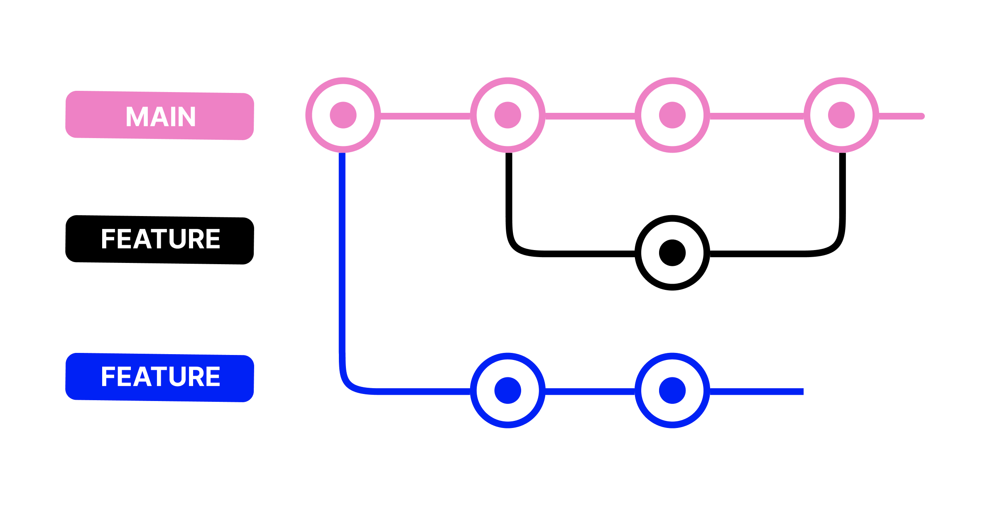

## What is [Git](https://git-scm.com/)?

**Git** is the most popular version control system in the world. It was created by Linus Torvalds (who also created Linux) in 2005.

### What Git does:

- **Saves snapshots** of your project at different points in time
- **Tracks changes** - knows exactly what was added, modified, or deleted
- **Enables collaboration** - multiple developers can work together
- **Works offline** - you don't need internet to use Git
- **Prevents disasters** - you can always undo mistakes

### Git vs Google Drive:

| Feature | Git | Google Drive |
|---------|-----|--------------|
| Purpose | Code & text files | Any files |
| Tracks changes | Line-by-line in code | Whole file only |
| Collaboration | Merge changes intelligently | Last save wins |
| Offline work | Yes | Limited |
| History | Complete detailed history | Basic version history |

---