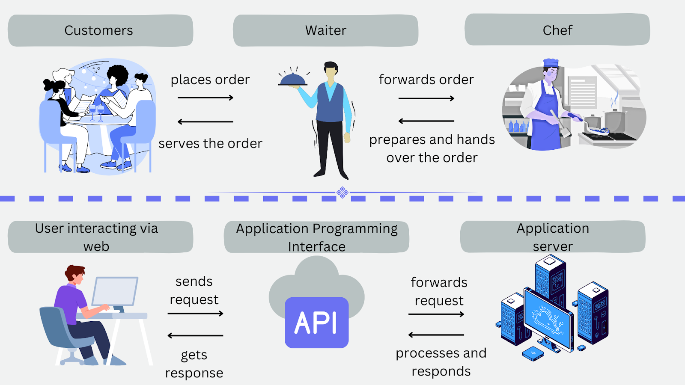

---
## Restaurant vs Web app
Imagine you're at a restaurant. You look at the menu (**frontend**), decide what you want, and tell the waiter (**API**). The waiter carries your order to the kitchen (**backend**), where the chef checks if ingredients are available in the pantry (**database**), cooks your meal, and sends it back through the waiter to your table. Web apps work approximately the same way.

---

## Restaurant vs Web Application components

| Restaurant Concept | Web Application Equivalent |
|--------------------|-----------------------------|
| Dining Room (what users see) | **Frontend (UI/UX)** |
| Waiter (carries messages) | **API** |
| Kitchen (where work happens) | **Backend / Server** |
| Pantry / Fridge (stores ingredients) | **Database** |

---