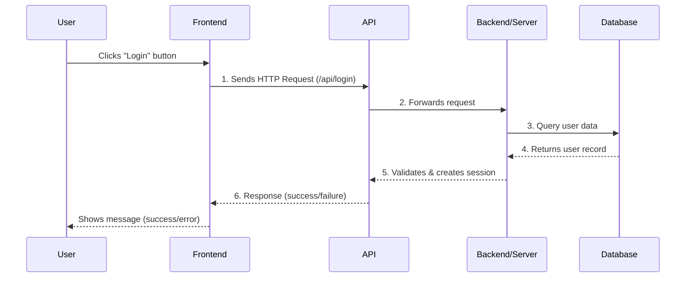

---
## The Request-Response Cycle

### **Frontend (UI/UX)**

The frontend is everything the user sees and interacts with in their browser. Like the dining room of a restaurant, it's designed to be welcoming, intuitive, and easy to navigate. It includes the visual design, layout, colors, fonts, and all interactive elements.

The frontend is built using **User Interface Elements** — the specific components users interact with such as buttons, forms, navigation menus, cards, modals, and input fields. These elements present options clearly and help users make decisions and take actions.

**Technologies:** HTML, CSS, JavaScript, React, Vue, Angular, CSS frameworks (Tailwind, Bootstrap), component libraries  
**Restaurant analogy:** The dining room's ambiance, lighting, and table arrangement, combined with the menu items, order buttons, call waiter button, and payment options that customers interact with. 

---

### **API (Application Programming Interface)**

The API acts as a messenger between the frontend and backend.  
When you click a button or submit a form, the API carries that request to the server and brings back the response.  
It defines how different parts of the application communicate.

**Technologies:** REST APIs, GraphQL, WebSockets, HTTP/HTTPS protocols  
**Restaurant analogy:** The waiter who takes your order to the kitchen and brings your food back to the table.

---

### **Backend / Server**

The backend is where the actual processing happens. It receives requests from the API, queries databases, performs calculations, validates data, and prepares responses. Users never see this part directly.  

The backend contains the business logic - the set of rules and processes that define how your application works. This includes calculations (like pricing with discounts), validations (checking if a product is in stock or if a password is strong enough), permissions (who can do what), and workflows (the steps to complete a purchase or user registration).  

**Technologies**: Node.js, Python (Django, Flask), Java (Spring), Ruby on Rails, PHP  
**Restaurant analogy**: The kitchen where all the food preparation and cooking takes place, combined with the chef's expertise - knowing how to prepare each dish, what ingredients to use, cooking times, and quality standards. The kitchen (backend infrastructure) and the chef's skills (business logic) work together to transform raw ingredients into finished meals.

---

### Database

The database is where all data is stored permanently — user accounts, products, orders, settings, and more. It's organized, searchable, and persistent. The backend queries the database to retrieve or update information.

All interactions with the database happen through **CRUD operations** - the four fundamental ways to work with data:

* **Create** — Add new data (e.g., new user registration, adding an item to cart)
* **Read** — Retrieve existing data (e.g., viewing product details, checking stock)
* **Update** — Modify existing data (e.g., changing quantity in cart, updating user profile)
* **Delete** — Remove data (e.g., removing an item from cart, deleting an account)

**Technologies:** PostgreSQL, MySQL, MongoDB, Redis, Firebase  
**Restaurant analogy:** The pantry and fridge where all ingredients are stored and organized. The chef **creates** a new dish order, **reads** what ingredients are available, **updates** the inventory when ingredients are used, and **deletes** expired items from the pantry.

---
