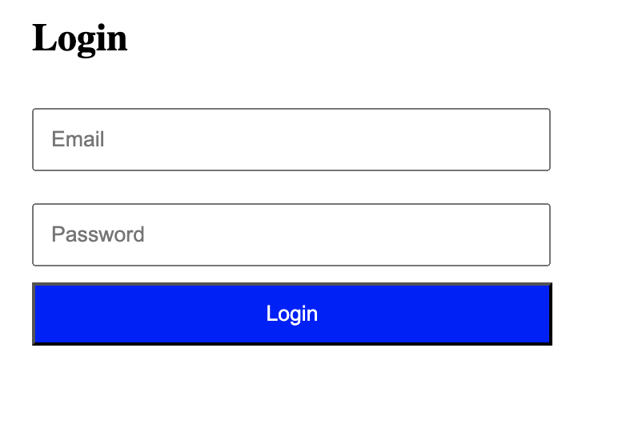

---

## Your Task

Read code examples (FE, BE, API, Database) and answer the provided questions about structure, functionality, and user experience.

---

## How to Approach

### 1. Read Line by Line
Start from the top. Don't skip parts you don't understand.

### 2. Google What You Don't Know
- "What does `type='password'` do in HTML"
- "CSS padding vs margin"
- "What is method POST in forms"

### 3. Answer with Specific Code References

**Answer example:**
"The user needs to provide email and password. There are two input fields: `<input type='email' id='email'>` for email and `<input type='password' id='password'>` for password."

---

## Tips

- **Reference actual code** - mention specific elements, attributes, or properties
- **Google first** - don't guess if you're unsure
- **Be specific** - explain what you found and where in the code

The goal is to **learn by analyzing real code**. Take your time and use Google liberally.

---

