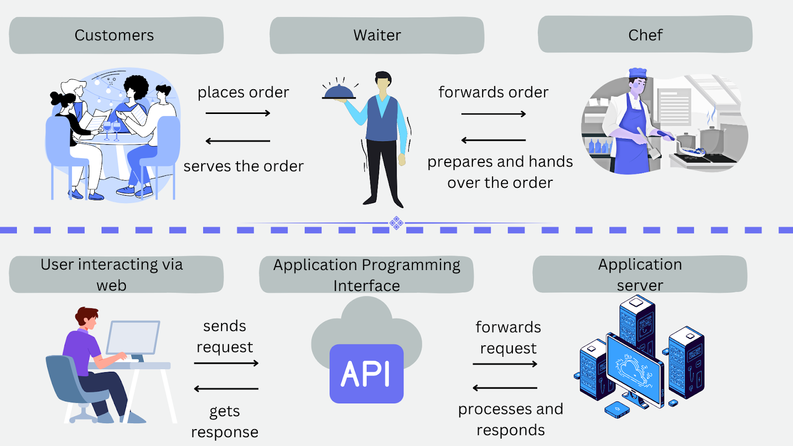

## Introduction to APIs

Think about ordering food at a restaurant. You want something from the kitchen, but you can't just walk in and cook it yourself. Instead, you tell the **waiter** what you want. The waiter goes to the kitchen and brings back your food.

An **API** works the same way - it's the messenger that helps your code talk to a server and get data back.

### What is an API?

An **API (Application Programming Interface)** is a way for different programs to talk to each other. It's like a menu at a restaurant that tells you:
- What you can order
- How to order it
- What you'll get back

### What is an API endpoint?

An **endpoint** is a specific web address (URL) where you can get specific data. 

Using our restaurant example:
- The **API** is the whole restaurant
- An **endpoint** is one specific dish on the menu

When you "order" from an endpoint (send a request), the server "serves" you data back (usually in a format called JSON).

### When you make a request to an API, you need to specify:

- **Where** you want to send the request (the endpoint/URL)
- **What** you want to do (the HTTP method)

---

## API rate limiting

Many APIs limit how many requests you can make:

**Why?**
- Prevent abuse
- Ensure fair usage
- Protect server resources
- Control costs

**Common limits:**
- 100 requests per hour (free tier)
- 1000 requests per hour (paid tier)
- 10,000 requests per day

**What happens when you exceed the limit?**
- You get a `429 Too Many Requests` error
- You must wait before making more requests

---

